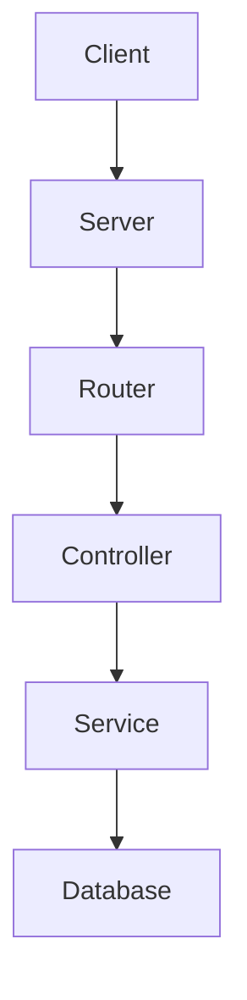

# Sample Node.js Application

This is a sample Node.js application to demonstrate basic functionality and structure.

## Features

- Simple HTTP server
- Basic routing
- JSON response

## Installation

```bash
git clone https://github.com/yourusername/sample-node-app.git
cd sample-node-app
npm install
```

## Usage

```bash
npm start
```

The server will start on `http://localhost:3000`.

## Project Structure

```plaintext
.
├── package.json
├── server.js
└── README.md
```

## Diagram



## Reference Links

- [Node.js](https://nodejs.org/)
- [Express.js](https://expressjs.com/)
- [Mermaid](https://mermaid-js.github.io/mermaid/)

## License

This project is licensed under the MIT License.